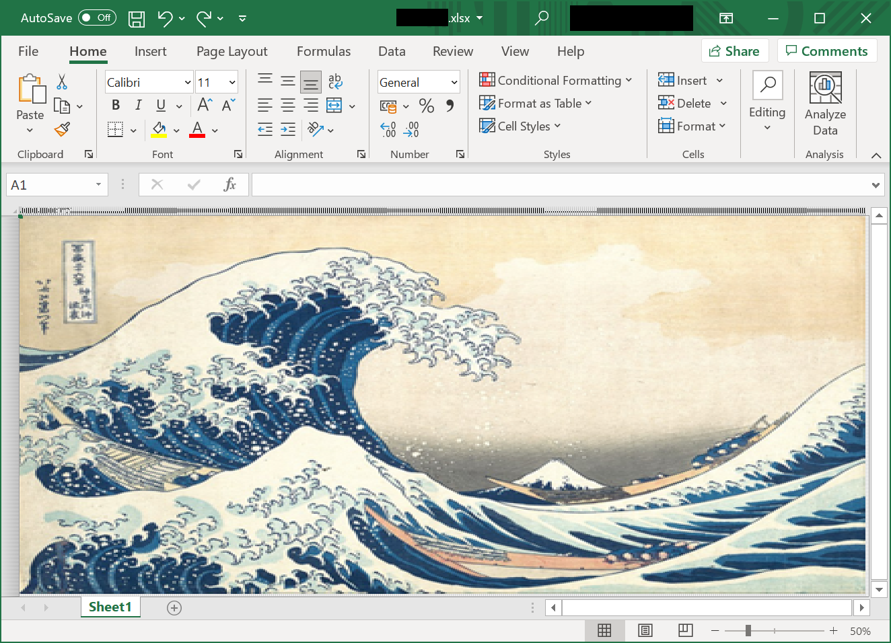
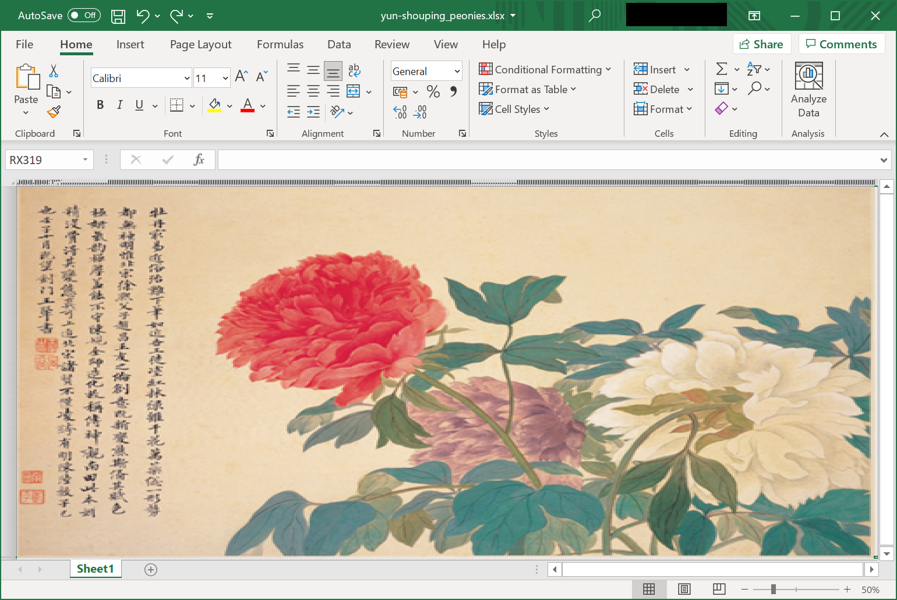
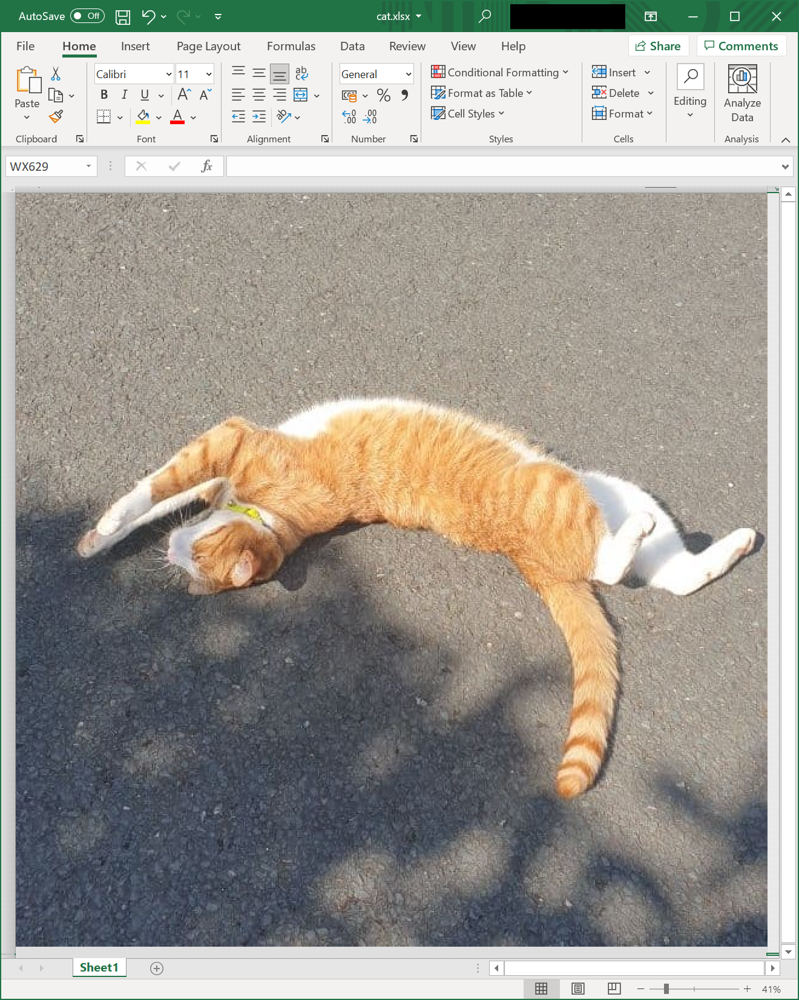

# Image to xslx/Excel Pixel Art Converter

Hokusai, The Great Wave off Kanagawa             |  Yun Shouping, Peonies | A cat
:-------------------------:|:-------------------------:|:-------------------------:
  |    | 

Note: This code is pretty old (and inefficient), but if anyone for some reason wants to convert an image to an Excel spreadsheet... it's here!

This small program converts an image file to .xslx pixel art, which can be opened on programs such as Microsoft Excel and Apache OpenOffice. Each cell is resized into a square, and its background color is set to that of the corresponding pixel on the source image.
This program is limited to producing images with up to [65,490 unique colors](https://support.microsoft.com/en-us/office/excel-specifications-and-limits-1672b34d-7043-467e-8e27-269d656771c3). This means that often, your image's dimensions will be reduced.

Examples, including the source, screenshots, and .xslx files can be found in the [examples directory](examples).

## Usage
Note: this program requires Python 3.x

- Redirect to the directory containing a copy of this repo. 
- Install all dependencies `pip install -r requirements.txt` 
- Run the command `python main.py imagename.extension cell_width` (for example, `python main.py examples\great-wave\great-wave.jpg 3`)

Final xslx output files will be saved to the `output` directory.

## Roadmap
* Move from NumPy to leverage xlsxwriter's inbuilt Pandas support, hopefully improving performance
* Add support for further image formats (currently limited to bmp, jpeg, and png)
* Give users the choice on whether to reduce image dimensions or reduce the colour profile (made possible by [converting color pallets](https://pillow.readthedocs.io/en/stable/reference/Image.html#PIL.Image.Image.convert)). 
* Parameterize tests
* Complete test suite 
